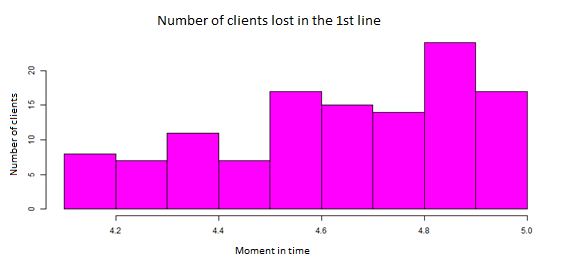
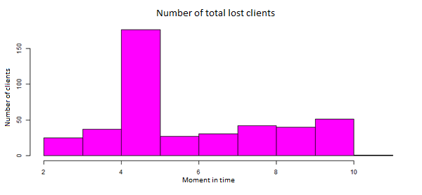

# Simulator_of_Queues_in_a_Restaurant

This is a simulation experiment of clients waiting in 2 successive queues. This experiment is meant to teach us how to estimate the statistics of satisfied/unsatisfied customers in a certain amount of time and how these statistics might change if we make changes to the circumstances.

The app is made in R, with the interface made with shinyapp.

Supposedly the events take place in a restaurant, which is open every day of the week between 9:00 am and 9:00 pm. The first queue is meant for placing orders and paying, and the second queue - for picking up the food. The maximum amount of people waiting in the first queue is 10, and in the second queue - 15. We count the people who come after the number is reached as unsatisfied customers. 

After 9:00 pm, no customers are allowed, but the ones already waiting in the queue will be served. 

The rush hours are 1:00 - 2:30 pm and 7:00 - 8:00 pm. 

We have implemented a function (called "genereaza_Ts") that receives the current time and generates randomly the time of the next client's appearance, which will always be greater than the current time. The variable for keeping in check with the time is 0 at 9 am and 12 at 9 pm. This function generates smaller time between each arrival during rush hours, so that more clients come during rush hours.

We also have implemented functions that will return the time of waiting in each line for every client (minus the amount of time one has to wait because of other clients who came before them). The first function, for the first line (called "genereaza_Y1") returns a value of 0.5 with the probability of 1/4, of 0.8 with the probability of 1/2 and so on. The second function (called "Norm) returns a random number of normal distribution of mean 15 and variance 2. Instead of using a convenient R function for random numbers of normal distribution, we used a mathematical algorithm that calculates this number based on a number of standard uniform distribution. The mathematical thinking and the process of finding the formula is in the paper. 

We also have decided upon a function (called "pret") that will give us the prices for the food consumed by each satisfied client. The function receives the amount of time (t) a client has to wait in the second line (the time needed for food to be prepared). The food for each client is prepared successively, not at the same time. The function returns a value equal to 5t^2 +  90t (t is always a very small number between 0 and 1). 

The main function is called "schema_simulare" and it moves in time to whichever event is closer: the arrival of a new client, the moment a client leaves the first line, or the moment a client leaves the system (the second line). The data of times of arrival, amount of time spent in each line, amount of money made, amount of satisfied and unsatisfied clients per each hour of the day and time of leaving is stored in different arrays for us to be able to make statistical graphs.

We also have counducted the experiment in which case the schedule of the restaurant starts one hour earlier, also in which case the schedule is increased by an hour later. 
Another experiment was seeing by how much will the income be increased if the maximum amount of people waiting for each line is increased by 5. 

The mean results we got, for 1000 experiments:

    The minimal time of waiting in the first line: 0.00833 hours
    The minimal time of waiting in the second line: 0.20602 hours
    The minimal time of waiting in the system: 0.21435 hours
    
    The maximal time of waiting in the first line: 1.139847 hours
    The maximal time of waiting in the second line: 3.73911 hours
    The maximal time of waiting in the system: 4.829137 hours
    
    The mean time of waiting in the 1st line: 0.1164337 hours
    The mean time of waiting in the 2nd line: 2.896499 hours
    The mean time of waiting in the system: 3.012932 hours

    Mean of number of clients served in a day: 58.956
    Moment in time of the first unsatisfied customer: 2.260393 (2.26 hours after opening)
    Mean number of unsatisfied clients who left 1st line: 116.754
    Mean number of clients of unsatisfied clients who left 2nd line: 309.789
    Mean number of unsatisfied clients who left the system: 426.543

    Mean daily income: 1344.772
    Minimum daily income: 1148.11
    Maximum daily income: 1444.978
    

    Mean daily income if the schedule starts one hour earlier: 1339.443
    Difference in income from the usual day: -5.328994
    Mean daily income if the schedule starts one hour later: 1452.947
    Difference in income from the usual day: 108.1755

    Mean daily income if the maximum amount of clients waiting in the 1st line is increased by 5: 1341.613
    Difference in income from the usual day: -3.158952
    Mean daily income if the maximum amount of clients waiting in the 2nd line is increased by 5: 1460.236
    Difference in income from the usual day: 115.4638

Conclusion:

During rush hours, even though the rate of clients' arrival is higher, the amount of served clients does not increase from the usual, because the rate of clients served in the 2nd queue is slow, and the amount of clients waiting reaches maximum, thus the loss of clients.

The only increase in income is if we increase the number of maximum clients waiting in the second queue, an increase of income of about 100.

The increase of maximum clients waiting in the 1st line rarely brings good results.

Also, the increase in income is noticed if the extend the schedule by an hour later. There's rarely any results if it is extended by 1 hour earlier.

